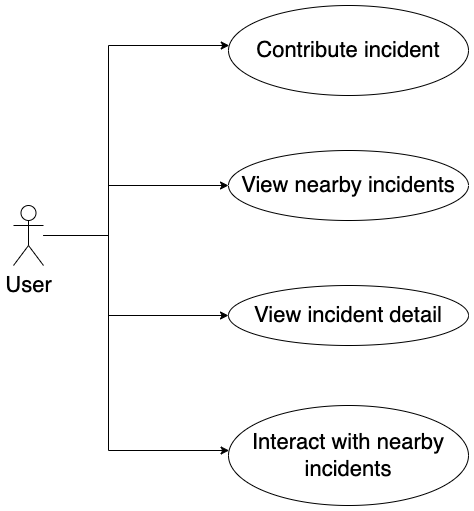

# 1. Usecase

- User should contribute to VCar community by reporting incidents on road or help verify the trustworthy of that event, so that all member of VCar community can benefit.



- Another way for a member to help VCar community is by issuing missing/wrong traffic sign. These usecases will be added later.

# 2. Incident type

Event code is based on the Alert-C code list. Tomtom's event code is following the same convention (see more [here](http://download.tomtom.com/open/manuals/Road_Event_Reporter/html/en-gb/Typesofeventyoucanreport.htm)). Currently, these  events are supported by tomtom and VCC. The full list of Alert-C code list can be founded [here](https://docs.inrix.com/reference/eventcode/).


|code|Name  |VCC|VCC menu    |VCC location option|VN      |Description     |
|----|---|--|--|--|--|--|
|201 |Accident                                                 |Y  |minor, major                       |onroad/shoulder    |Tai nạn                                  |Có tai nạn trên đường                                                                                                                                                                                           |
|214 |Incident                                                 |Y  |incident->other                    |onroad/shoulder    |Sự cố                                    |Có sự cố trên đường                                                                                                                                                                                             |
|905 |Fallen trees                                             |Y  |incident->fallen trees             |onroad/shoulder    |Cây đổ                                   |                                                                                                                                                                                          m                      |
|907 |Flooding                                                 |Y  |incident->flooding                 |onroad/otherside   |Lũ lụt                                   |                                                                                                                                                                                                                |
|61  |Object on roadway (does not block the road or part of it)|Y  |incident->object on road->not block|onroad/otherside   |                                         |                                                                                                                                                                                                                |
|63  |Object on the road. Danger                               |Y  |incident->object on road->block    |onroad/otherside   |                                         |                                                                                                                                                                                                                |
|1033|Serious fire, danger                                     |Y  |incident->fire                     |onroad/otherside   |Hỏa hoạn, nguy hiểm                      |Có hỏa hoạn xảy ra trên đường hoặc ven đường                                                                                                                                                                    |
|1304|Fog                                                      |Y  |weather->fog                       |                   |Sương mù                                 |                                                                                                                                                                                                                |
|1112|Rain                                                     |Y  |weather->rain                      |                   |Mưa                                      |                                                                                                                                                                                                                |
|101 |Stationary traffic                                       |Y  |traffic->major                     |                   |Tắc cứng                                 |                                                                                                                                                                                                                |
|115 |Slow traffic                                             |Y  |traffic->minor                     |                   |Lưu thông chậm                           |                                                                                                                                                                                                                |
|108 |Queuing traffic                                          |Y  |traffic->moderate                  |                   |Tắc đường cục bộ                         |                                                                                                                                                                                                                |
|405 |No through traffic                                       |Y  |traffic->standstill                |                   |Không nên lưu thông                      |Phương tiên không nên lưu thông về phía trước trên đường hiện tại do một số lý do ví dụ đường phía trước là tài sản cá nhân, người chủ không muốn cho lái xe đi qua gây ồn ào, hay đường trước mặt là đường cụt…|
|1498|Police activity ongoing                                  |Y  |police->{visible, hidden}          |otherside          |Cảnh sát hoạt động                       |                                                                                                                                                                                                                |
|1107|Sleet, visibility reduced                                |N  |weather->sleet                     |                   |Mưa tuyết, giảm tầm nhìn                 |                                                                                                                                                                                                                |
|401 |Closed                                                   |N  |                                   |                   |Đường bị đóng                            |Đường bị đóng, thường là chặn cả hai đầu                                                                                                                                                                        |
|24  |Bridge closed                                            |N  |                                   |                   |Cầu bị đóng                              |Cầu bị đóng, thường là cả hai đầu                                                                                                                                                                               |
|500 |Lane closed                                              |N  |                                   |                   |Làn đường bị đóng                        |Làn đường bị đóng, thường là cả hai đầu                                                                                                                                                                         |
|641 |One lane closed                                          |N  |                                   |                   |Một làn đường bị đóng                    |Một làn đường bị đóng, thường là cả hai đầu                                                                                                                                                                     |
|520 |Lane blocked                                             |N  |                                   |                   |Làn đường bị chặn                        |Làn đường bị chặn, thường là ở 1 điểm                                                                                                                                                                           |
|403 |Closed for heavy vehicles                                |N  |                                   |                   |Đóng đối với xe tải hạng nặng            |Đường đóng đối với xe tải hạng nặng (>4.5 tấn)                                                                                                                                                                  |
|1035|Impassable                                               |N  |                                   |                   |Không thể lưu thông                      |Đường không thể lưu thông do lũ lụt, sụt lở hoặc bị chặn bởi vật cản khác. Điều kiện của đường có thể thay đổi nhanh chóng và gây nguy hiểm cho người tham gia giao thông.                                      |
|810 |New roadworks layout                                     |N  |                                   |                   |Định tuyến sang đường khác do thi công   |Đường đang thi công, các phương tiên được định tuyến sang đường khác                                                                                                                                            |
|742 |Sets of roadworks, single alternate line traffic         |N  |                                   |                   |Đường đang thi công, sử dụng làn thay thế|Đường đang thi công, các phương tiện phải di chuyển trên đúng cung đường đó nhưng chỉ trên 1 làn/chiều, tùy thuộc vào vị trí thi công                                                                           |
|1510|Parade                                                   |N  |                                   |                   |Diễu hành                                |                                                                                                                                                                                                                |
|1461|Marathon                                                 |N  |                                   |                   |Chạy đường trường (marathon)             |                                                                                                                                                                                                                |
|1661|Ferry service not operating                              |N  |                                   |                   |Dịch vụ phà không hoạt động              |                                                                                                                                                                                                                |
|707 |Bridge maintenance work                                  |N  |                                   |                   |Bảo dưỡng cầu                            |                                                                                                                                                                                                                |
|703 |Set of maintenance work                                  |N  |                                   |                   |Bảo dưỡng đường                          |                                                                                                                                                                                                                |
|704 |Section of resurfacing work                              |N  |                                   |                   |Làm lại mặt đường                        |                                                                                                                                                                                                                |
|806 |Set of water main work                                   |N  |                                   |                   |Thi công đường ống nước trên đường       |                                                                                                                                                                                                                |
|803 |Set of construction work                                 |N  |                                   |                   |Xây dựng trên đường                      |                                                                                                                                                                                                                |
|807 |Set of gas main work                                     |N  |                                   |                   |Thi công đường ống gas trên đường        |                                                                                                                                                                                                                |
|211 |Broken down vehicle                                      |N  |                                   |                   |Xe hỏng                                  |                                                                                                                                                                                                                |
|1472|People on roadway                                        |N  |                                   |                   |Có người trên đường                      |                                                                                                                                                                                                                |
|701 |Roadworks                                                |N  |                                   |                   |Đường đang thi công                      |Đường đang thi công, có thể do xây dựng, sửa chữa hoặc bảo dưỡng, bao gồm các công việc thi công trên đường hoặc bên cạnh đường.                                                                                |

# 3. Database

### Some constraints:
- Tomtom's and VCC's incidents must have the same (or at least similar) 
database structure so that the system can perform same queries on both datasets

- Design must take into account the different nature of how both dataset are born and updated. 
    + For Tomtom incident service, the whole data are update periodically, so that after some times we have a newly overwritten dataset.
    + For VCC, each incident are created by user, its endtime are set by default and may be extended by users' interaction (for example: event still there, disappear, ...)
    + User can interact with incident from both Tomtom or VCC, such as: like, comment, or report the incident has been resolved

- Frequent queries over dataset are:  
     + Get details of an incident: location, magnitude, number of like, comments about particular incident
     + View neary living incidents (with or without a filter such as traffic-related incidents or weather-related incidents). *living* means incident has not yet been ended.
     + Check for possible duplicate incident
     + Check for accident on a given route (ex. frequent routes)
     + Some audit-related queries to verify trustworthy of incident and calculate score for contributor. [to be added later]

- Both dataset should support for cleaning up old data


### Database

- Tomtom

Tomtom table format 

Schema:
`incident_ids` -- this table stands here for 
```sql
id uuid NOT NULL PRIMRARY KEY,
tomtom_id text UNIQUE,              -- in case vcc's incident tomtom_id is null
created_at timestamp not null       -- must provide by client
```

`tomtom_incident`
```sql
id uuid NOT NULL REFERENCE incident_ids,                   -- generate from vcar side
incident_id text NOT NULL,          -- return from tomtom service incident
icon_category_id int4 NULL,
magnitude_id int4 NULL,
start_time timestamp NULL,
end_time timestamp NULL,
from_addr text NULL,
to_addr text NULL,
st_length float8 NULL,
delay_s int4 NULL,
road_number text NULL,
aci_id int4 NULL,
events jsonb NULL,
road_segment traffic.geometry(linestring, 4326) NULL,
created_time timestamp NULL DEFAULT now(),      -- consider moving to `incident_ids`
updated_time timestamp NULL,
matched_road_segment traffic.geometry NULL,
node_ids text NULL
```

- VCC
`vcc_incident`

```sql
id UUID NOT NULL PRIMRARY KEY REFERENCE incident_ids,
user_id id NOT NULL, -- id of user who contributes this incident
start_time timestamp NOT NULL,
end_time timestamp NULL,
events jsonb NOT NULL,
location geometry(linestring, 4326) NOT NULL, -- maybe point or multipoint
is_onroad boolean default true, -- an incident may be on road or on the roadside
matched_location geometry(linestring, 4326) NULL, -- when incident is on the roadside, we don't need to find matched_loation as it doesn't exist

```

- Views
Union view of both sources of incident (VCC and Tomtom)

`incident_view`

```sql
CREATE VIEW incident 

AS

SELECT id, start_time, end_time, events, created_time,
road_segment as location, matched_road_segment as matched_location,
false,  -- is_onroad
'ttm' as source
FROM tomtom_incident

UNION ALL

SELECT id, start_time, end_time, events, created_time,
location, matched_location,
is_onroad,
'vcc' as source
FROM vcc_incident
```
    
`incident_interaction`
```sql
id uuid NOT NULL PRIMARY KEY
incident_id text NOT NULL REFERENCE incident_ids,
user_id id NOT NULL REFERENCE users,
interaction_id INT NOT NULL
comment TEXT,
created_at timestampt NOT NULL DEFAULT NOW(),

CONSTRAINT comment_not_null CHECK (
    NOT (interaction_id = 2 AND comment IS NULL )
)
```

`interaction`
| id | interaction | description
|---|----|---|
| 0 | like |  |
| 1 | unlike |  | 
| 2 | comment |   |
| 3 | resolved | user report that either the incident is not there or simply resolved |


- Score ???


# 5. Backend and implementation
+ Get details of an incident: location, magnitude, number of like, comments about particular incident

  - Indexing on incident id
  - Grouping by colum `incident_id` on `incident_interaction` table; indexing on `created_at`


+ Query: "Find all LIVING incidents within a point P and radius R" => use [`ST_DWithin`](https://postgis.net/docs/ST_DWithin.html), and indexing on `matched_location` or `location`, `start_time`

More: [ST_DWithin](https://postgis.net/docs/ST_DWithin.html)
```
-- Create table with spatial column

CREATE TABLE IF NOT EXISTS mytable (
  id SERIAL PRIMARY KEY,
  geom GEOMETRY(Point, 4326),
  name VARCHAR(128)
);

-- Create index on geography
CREATE INDEX geograph_gix_geo
ON mytable
USING GIST((geom::geography));    // <-- indexing on geography 

-- Query for nearby points
EXPLAIN ANALYSE VERBOSE
SELECT id, name, geom, st_astext(geom),
      st_distancesphere(geom, 'SRID=4326;POINT(105.78325313632352 21.02768037696414)')
FROM mytable
WHERE ST_DWithin(
  geom::geography,
  st_geographyfromtext('POINT(105.78325313632352 21.02768037696414)'),
  3000
);


-- Without indexing on geography
Seq Scan on public.mytable  (cost=0.00..127.30 rows=1 width=350) (actual time=0.024..0.045 rows=3 loops=1)
"  Output: id, name, geom, st_astext(geom), st_distance(geography(geom), '0101000020E6100000EF3FC3D120725A404BCDA90F16073540'::geography, false)"
"  Filter: st_dwithin((mytable.geom)::geography, '0101000020E6100000EF3FC3D120725A404BCDA90F16073540'::geography, '3000'::double precision, true)"
  Rows Removed by Filter: 1
Planning Time: 0.130 ms
Execution Time: 0.062 ms

- With spatial indexing

Index Scan using geograph_gix_geo on public.mytable  (cost=0.26..59.53 rows=1 width=350) (actual time=0.037..0.044 rows=3 loops=1)
"  Output: id, name, geom, st_astext(geom), st_distance(geography(geom), '0101000020E6100000EF3FC3D120725A404BCDA90F16073540'::geography, false)"
"  Index Cond: ((mytable.geom)::geography && _st_expand('0101000020E6100000EF3FC3D120725A404BCDA90F16073540'::geography, '3000'::double precision))"
"  Filter: st_dwithin((mytable.geom)::geography, '0101000020E6100000EF3FC3D120725A404BCDA90F16073540'::geography, '3000'::double precision, true)"
Planning Time: 0.154 ms
Execution Time: 0.077 ms

-- st_distance is not using INDEXING

explain analyse verbose
select id, name,
       st_astext(geom),
        st_distance(st_geomfromtext('POINT(105.78325313632352 21.02768037696414)', 4326), geom),
         st_distance(st_geomfromtext('POINT(105.78325313632352 21.02768037696414)', 4326), geom, true),
       st_distancesphere(st_geomfromtext('POINT(105.78325313632352 21.02768037696414)', 4326), geom)
FROM mytable
where st_distancesphere(st_geomfromtext('POINT(105.78325313632352 21.02768037696414)', 4326), geom) < 350;

Seq Scan on public.mytable  (cost=0.00..177.31 rows=1 width=334) (actual time=4.089..4.113 rows=3 loops=1)
"  Output: id, name, st_astext(geom), st_distance('0101000020E6100000EF3FC3D120725A404BCDA90F16073540'::geometry, geom), st_distance('0101000020E6100000EF3FC3D120725A404BCDA90F16073540'::geography, (geom)::geography, true), st_distance('0101000020E6100000EF3FC3D120725A404BCDA90F16073540'::geography, geography(geom), false)"
"  Filter: (st_distance('0101000020E6100000EF3FC3D120725A404BCDA90F16073540'::geography, geography(mytable.geom), false) < '350'::double precision)"
  Rows Removed by Filter: 1
Planning Time: 0.332 ms
Execution Time: 4.149 ms


```

+ Check for possible duplicate incident
Just use nearby incident (`radius = xyz meters`) with some conditions to check

+ Check if there is accident on a given route (ex. frequent routes)

```
Frequent routes: NodeID[] = int[] 
Accidents  : NodeID[] = int[]
```
=> intersect between two arrays 
=> need for fast check
=> using [intarray](https://www.postgresql.org/docs/9.1/intarray.html) extensiona  to check for possible collapse between two arrays (`&&` operator)

+ Cleaning up old data
Create partition table and delete old partition.
Solution:
  - Using `timescaledb` extension for Postgres
  - Auto create partition and add `retention policy`
For example:

```
CREATE TABLE traffic.tomtom_incidents (
                                   id uuid NOT NULL,
                                   incident_id text NULL,
                                   icon_category_id int4 NULL,
                                   magnitude_id int4 NULL,
                                   start_time timestamp NULL,
                                   end_time timestamp NULL,
                                   from_addr text NULL,
                                   to_addr text NULL,
                                   st_length float8 NULL,
                                   delay_s int4 NULL,
                                   road_number text NULL,
                                   aci_id int4 NULL,
                                   events jsonb NULL,
                                   road_segment traffic.geometry(linestring, 4326) NULL,
                                   created_time timestamp NULL DEFAULT now(),
                                   matched_road_segment traffic.geometry NULL,
                                   node_ids text NULL,
                                   CONSTRAINT fk_aci FOREIGN KEY (aci_id) REFERENCES traffic.aci(id),
                                   CONSTRAINT fk_icon FOREIGN KEY (icon_category_id) REFERENCES traffic.icon_category(id),
                                   CONSTRAINT fk_magnitude FOREIGN KEY (magnitude_id) REFERENCES traffic.magnitude_delay(id)
);

select create_hypertable('traffic.tomtom_incidents', 'created_time', chunk_time_interval := interval '3 days');

SELECT add_retention_policy('traffic.tomtom_incidents', INTERVAL '6 days');
```
 
- For a moving car, if it is moving in its frequent route, is there any newly acident ahead?
    + Is it moving on a frequent route?
    + Is there is newly emerged incident on a particular frequent route?
    + If this is the case, is the incident ahead of the car or is passed by on its frequent route?
    + 
## Reference

Bản ghi ví dụ:
```
'43c077bc-66b1-4097-87f1-6202c5f63f2f'	
'55bf40fced6cbb052cb2df7b21702f28'	
6	
1	
2022-06-16 09:18:00.000000	
2022-06-16 10:31:30.000000	
"Tỉnh lộ 283 / Tỉnh Lộ 291"
"Đường Quốc Lộ 38 / Đê Tả Sông Đuống"
751.8980484833
121	
TL 291	
0	
[{"code": 115, "descEN": "Slow traffic", "descVN": "Lưu thông chậm"}]
"0102000020E61000001600000009916DD087855A4069E18D681D133540BA91AD4389855A40CDBEC6C41A133540A77BAD248A855A400B7B14D618133540587CED978B855A402DF9C3C215133540F2862DDE8C855A40A7E0249912133540A2876D518E855A40C522C0C80F133540D885EDCF8F855A409BA748330E1335401A7FED6491855A408069AA0E0D1335408880EDA799855A40C44B6AC305133540A78CCDC0A0855A40C9E0A11A01133540DB920DCEAD855A4010E5D667F8123540EF7DCD19B1855A4068DFC29DF71235402982ED5CB7855A40F38C991EF6123540EC8E8D8CBA855A404186C0A0F41235403E80AD18C3855A4094449819F4123540BB796D29C5855A40EBAD4903F412354071920D7CE1855A40DB707092F3123540147F8DCDE2855A40CAA25CD5F3123540AE89CD13E4855A40E5E0FAF9F4123540727F6D35E6855A40B43F11C1F8123540637D0D05EF855A40524BF71A09133540017AAD4AFA855A40CB4B04061E133540"
2022-06-16 10:12:08.565919
"0102000020E610000016000000978FA4A487855A40BC94BA641C133540AE9D280989855A403A1E335019133540AE9D280989855A403A1E3350191335408F368E588B855A4043AB9333141335408F368E588B855A4043AB933314133540FF4124438E855A408D2782380F133540FF4124438E855A408D2782380F1335406876DD5B91855A40EE974F560C133540F3CAF5B699855A40325706D506133540A80018CFA0855A40A0A9D72D021335407D3CF4DDAD855A4063F20698F9123540715AF0A2AF855A401689096AF8123540847EA65EB7855A40C362D4B5F61235403C50A73CBA855A401DAED51EF612354001BD70E7C2855A40A7B1BD16F412354001BD70E7C2855A40A7B1BD16F41235406F66F4A3E1855A4008228B34F11235406F66F4A3E1855A4008228B34F11235400262122EE4855A406005F86EF3123540CCB8A981E6855A40236B0DA5F61235404A5F0839EF855A40BBF2599E07133540E04735ECF7855A40537AA69718133540"
"4172434737,4172434742,4172434737,8823243584,8823243560,8823243561,8747052182,9367594917"
```